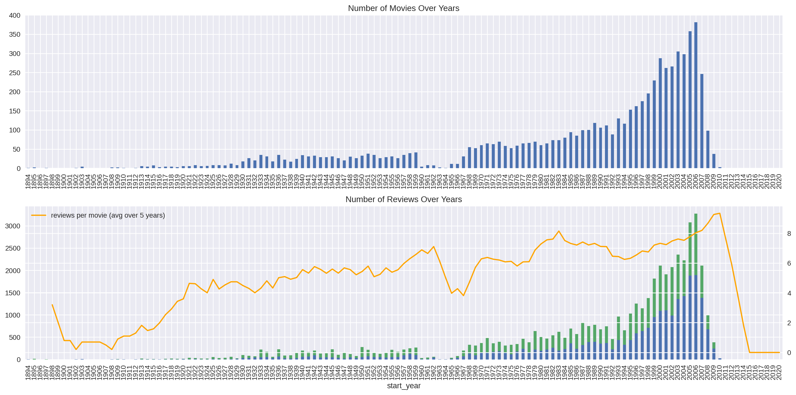
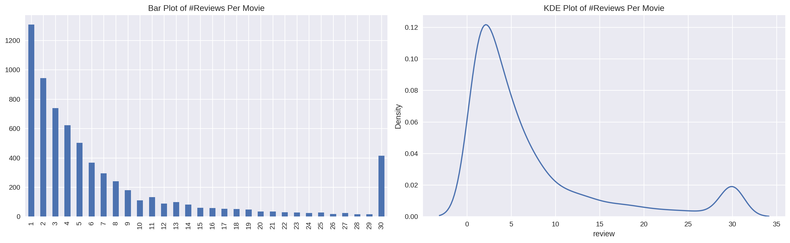
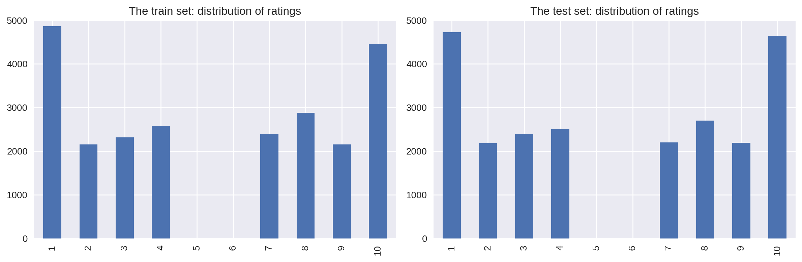
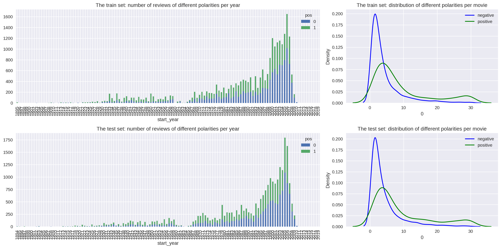
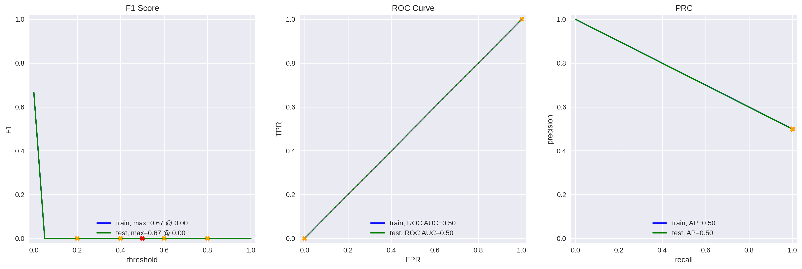
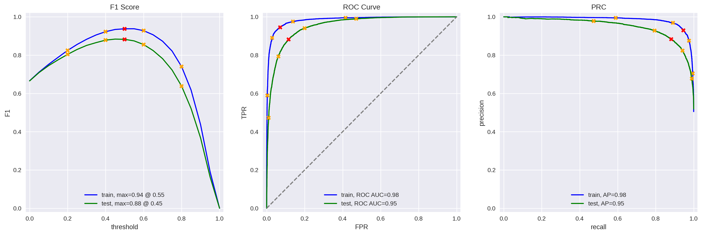

# Film-Junky-Union-Machine-Learning-for-Texts-
The Film Junky Union is developing a system for filtering and categorizing movie reviews. The goal is to train a model to automatically detect negative reviews. Dataset from IMBD movie reviews with polarity labelling to build a model for classifying positive and negative reviews. It will need to have an F1 score of at least 0.85.

🎬 Film Junky Union – Movie Data Analysis

This project explores trends in movie metadata using Python. From analyzing genre popularity and runtime distribution to revenue vs. rating correlations, this notebook helps understand what drives film performance and audience engagement.

📚 Table of Contents
About the Project

Installation

Usage

Project Structure

Technologies Used

Results & Insights

Screenshots

Contributing

License

📌 About the Project
This notebook uses a movie dataset to uncover:

Genre trends over time

Correlation between budget, revenue, and ratings

Runtime distribution across decades

Visual summaries of top-rated and highest-grossing films

Audience and critic score comparisons

The goal is to gain insights that could inform production, acquisition, or marketing decisions.

🛠 Installation
Clone the repo or download the .ipynb file

Install required libraries:

bash
Copy
Edit
pip install pandas numpy matplotlib seaborn jupyter
Launch the notebook:

bash
Copy
Edit
jupyter notebook

🚀 Usage
Open Film Junky Union.ipynb and run the cells. The notebook includes:

Data cleaning and parsing

EDA with grouped visualizations

Correlation and distribution plots

Trend analysis using line and bar charts

📁 Project Structure
bash
Copy
Edit
Film Junky Union.ipynb              # Main analysis notebook
README.md                           # This file
images_filmjunky/                   # Folder with screenshots
⚙️ Technologies Used
Python 3.8+

Jupyter Notebook

Pandas

NumPy

Seaborn

Matplotlib

📊 Results & Insights

Comedy and Drama dominate in frequency but Action and Adventure lead in revenue

Longer runtimes don’t guarantee higher ratings

Critic and user scores are moderately correlated (~0.6)

A KDE plot shows the probability density of a continuous variable by creating a smooth curve over the data points. Both charts above showcase that movies earlier in the dataframe have a larger amount of reviews. In model creation the train and test set look identical in their distribution of ratings.  This means that once the models have been trained it should be accurate being run on the test set. The test set seems to have a smoother curve of positive reviews compared to the train set in the first 10 movies.  The test set also seems to have more fluctuations in the negative reviews compared to the train set. 

📸 Screenshots
markdown
Copy
Edit
### 🎞️ Genre Popularity Over Time  

### 🎯 Revenue vs Rating Scatter  

### 🧮 Runtime Distribution  

### 💰 Top-Grossing Films  

### 🍅 Audience vs Critic Ratings  

### 🗓️ Release Volume by Year  

### ⭐ Average Ratings by Genre  

### 🎬 Budget Trends  

🤝 Contributing
Have ideas for adding clustering, recommendation systems, or IMDb scraping? Fork the repo and contribute!

🪪 License
This project is licensed under the MIT License

