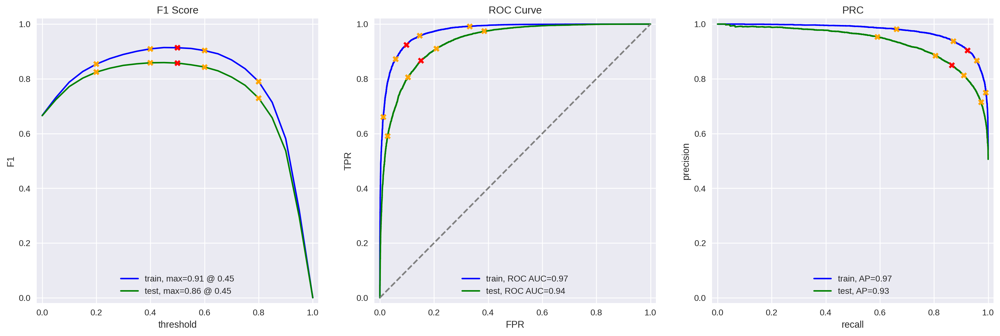

##Project Overview: Film Junky Union – Sentiment Classification of IMDB Movie Reviews

This project presents a scalable pipeline for binary sentiment classification using IMDb movie reviews. The objective was to develop a robust model capable of detecting negative sentiment in user-generated content with an F1 score ≥ 0.85, supporting a broader system for filtering and categorizing movie reviews in an online film discussion community.

The dataset—curated by Andrew Maas et al. (ACL 2011)—contains labeled IMDb reviews annotated for sentiment polarity (pos: 0 = negative, 1 = positive) and partitioned into train/test subsets.

Key contributions include:

Text Preprocessing & Feature Engineering: Implemented multiple NLP pipelines using NLTK and spaCy for tokenization and lemmatization, followed by vectorization with TF-IDF.

Model Training & Evaluation: Trained several classifiers (DummyClassifier, Logistic Regression, LGBMClassifier, and BERT-based embeddings) using scikit-learn and LightGBM. Performance was assessed using Accuracy, F1 Score, Average Precision Score (APS), and ROC AUC metrics across both training and test sets.

Reusable Evaluation Functions:

evaluate_model() – Custom function to evaluate classifiers with consistent metric reporting.

BERT_text_to_embeddings() – Converts raw text into dense vector representations using BERT for downstream classification.

Pipeline & Visualization: Created a modular ML pipeline to manage preprocessing, training, and evaluation phases. Performance metrics are visualized to enable model comparison across multiple runs.

### Technical Workflow

1. **Data Loading & Inspection**  
   Loaded IMDb review dataset and verified schema integrity (`review`, `pos`, `ds_part`). Ensured consistent encoding and absence of structural anomalies.

2. **Text Preprocessing**  
   Applied text normalization techniques including lowercasing, punctuation removal, stopword filtering, and tokenization using `spaCy` and `NLTK`. Generated TF-IDF feature matrices for model training.

3. **Exploratory Data Analysis (EDA)**  
   Analyzed class distribution and review frequency over time. Conducted Kernel Density Estimation (KDE) and histogram visualizations to evaluate data skewness, temporal patterns, and review volume.

4. **Dataset Partitioning**  
   Maintained original train/test split from the dataset. Verified that label distributions and feature characteristics were consistent between splits.

5. **Model Development**  
   Trained and evaluated a baseline `DummyClassifier`, followed by more sophisticated models including:
   - Logistic Regression with TF-IDF features  
   - LightGBM with TF-IDF features  
   - Transformer-based embeddings (BERT) with downstream classifier

6. **Evaluation Metrics**  
   Measured model performance using Accuracy, F1 Score, Average Precision Score (APS), and ROC AUC. Created comparison tables and visualizations to assess generalization and avoid overfitting.

7. **Inference on Custom Inputs**  
   Generated synthetic movie reviews and ran inference across all trained models. Compared outputs and confidence levels to validate model behavior on edge cases and borderline sentiments.

8. **Model Comparison & Analysis**  
   Compared test set performance across classifiers. Interpreted metric deltas and analyzed possible sources of performance divergence, including feature representation and model complexity.

9. **Visualization & Reporting**  
   Developed custom plots for F1, Precision, and ROC curves using Matplotlib/Seaborn. Summarized key

Results were as followed:
### Model Evaluation Results

| Model                          | Metric     | Train | Test |
|--------------------------------|------------|-------|------|
| **DummyClassifier**            | Accuracy   | 0.50  | 0.50 |
|                                | F1         | 0.00  | 0.00 |
|                                | APS        | 0.50  | 0.50 |
|                                | ROC AUC    | 0.50  | 0.50 |
| **NLTK + TF-IDF + LR**         | Accuracy   | 0.94  | 0.88 |
|                                | F1         | 0.94  | 0.88 |
|                                | APS        | 0.98  | 0.95 |
|                                | ROC AUC    | 0.98  | 0.95 |
| **spaCy + TF-IDF + LR**        | Accuracy   | 0.93  | 0.88 |
|                                | F1         | 0.93  | 0.88 |
|                                | APS        | 0.98  | 0.95 |
|                                | ROC AUC    | 0.98  | 0.95 |
| **spaCy + TF-IDF + LGBM**      | Accuracy   | 0.91  | 0.86 |
|                                | F1         | 0.91  | 0.86 |
|                                | APS        | 0.97  | 0.93 |
|                                | ROC AUC    | 0.97  | 0.94 |

🛠 Installation
Clone the repo or download the .ipynb file

Install required libraries:

bash
Copy
Edit
pip install pandas numpy matplotlib seaborn jupyter
Launch the notebook:

bash
Copy
Edit
jupyter notebook

🚀 Usage
Open Film Junky Union.ipynb and run the cells. The notebook includes:

Data cleaning and parsing

EDA with grouped visualizations

Correlation and distribution plots

Trend analysis using line and bar charts

📁 Project Structure
bash
Copy
Edit
Film Junky Union.ipynb              # Main analysis notebook
README.md                           # This file
images_filmjunky/                   # Folder with screenshots
⚙️ Technologies Used
Python 3.8+

Jupyter Notebook

Pandas

NumPy

Seaborn

Matplotlib

📸 Screenshots
markdown
Copy
Edit
### 🎞️ Genre Popularity Over Time  

### 🎯 Revenue vs Rating Scatter  

### 🧮 Runtime Distribution  

### 💰 Top-Grossing Films  

### 🍅 Audience vs Critic Ratings  

### 🗓️ Release Volume by Year  

### ⭐ Average Ratings by Genre  

### 🎬 Budget Trends  

🤝 Contributing
Have ideas for adding clustering, recommendation systems, or IMDb scraping? Fork the repo and contribute!

🪪 License
This project is licensed under the MIT License

